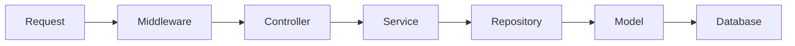

# Arquitectura del Sistema

- [Estructura de Directorios](#directory-structure)
- [Patrones de Diseño](#design-patterns)
- [Flujo de la Aplicación](#application-flow)
- [Componentes Principales](#main-components)

<a name="directory-structure"></a>
## Estructura de Directorios

```plaintext
sistema-encuestas/
├── app/
│   ├── Console/           # Comandos personalizados
│   ├── Http/
│   │   ├── Controllers/   # Controladores
│   │   ├── Middleware/    # Middleware
│   │   └── Requests/      # Form Requests
│   ├── Models/            # Modelos Eloquent
│   ├── Services/          # Servicios
│   └── Repositories/      # Repositorios
├── database/
│   ├── factories/         # Factories para testing
│   ├── migrations/        # Migraciones
│   └── seeders/          # Seeders
└── tests/                 # Tests
```

<a name="design-patterns"></a>
## Patrones de Diseño

### Repository Pattern
```php
namespace App\Repositories;

interface SurveyRepositoryInterface {
    public function all();
    public function find($id);
    public function create(array $data);
    public function update($id, array $data);
    public function delete($id);
}
```

### Service Layer Pattern
```php
namespace App\Services;

class SurveyService {
    public function createSurvey(array $data) {
        // Lógica de negocio
    }
}
```

<a name="application-flow"></a>
## Flujo de la Aplicación



<a name="main-components"></a>
## Componentes Principales

### Controllers
- SurveyController
- QuestionController
- ResponseController

### Services
- SurveyService
- AnalyticsService
- ReportService

### Models
- Survey
- Question
- Response
- User