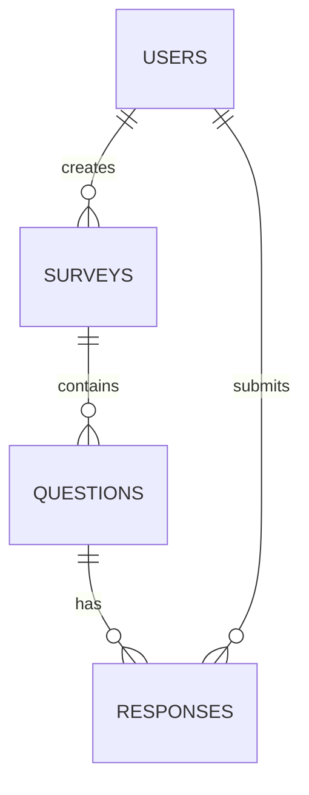

# Base de Datos

- [Modelo de Datos](#data-model)
- [Migraciones](#migrations)
- [Relaciones](#relationships)
- [Índices y Optimización](#optimization)

<a name="data-model"></a>
## Modelo de Datos

### Diagrama ERD


<a name="migrations"></a>
## Migraciones

### Surveys Table
```php
Schema::create('surveys', function (Blueprint $table) {
    $table->id();
    $table->string('title');
    $table->text('description')->nullable();
    $table->foreignId('user_id')->constrained();
    $table->timestamp('starts_at')->nullable();
    $table->timestamp('ends_at')->nullable();
    $table->timestamps();
});
```

### Questions Table
```php
Schema::create('questions', function (Blueprint $table) {
    $table->id();
    $table->foreignId('survey_id')->constrained()->onDelete('cascade');
    $table->string('question_text');
    $table->string('type'); // multiple_choice, text, etc.
    $table->json('options')->nullable();
    $table->boolean('required')->default(false);
    $table->integer('order')->default(0);
    $table->timestamps();
});
```

<a name="relationships"></a>
## Relaciones

### Modelo Survey
```php
class Survey extends Model
{
    public function questions()
    {
        return $this->hasMany(Question::class);
    }

    public function responses()
    {
        return $this->hasManyThrough(Response::class, Question::class);
    }
}
```

<a name="optimization"></a>
## Índices y Optimización

### Índices Recomendados
```sql
CREATE INDEX idx_surveys_user_id ON surveys(user_id);
CREATE INDEX idx_questions_survey_id ON questions(survey_id);
CREATE INDEX idx_responses_question_id ON responses(question_id);
```

### Consultas Optimizadas
```php
// Ejemplo de consulta optimizada con eager loading
Survey::with(['questions.responses'])
    ->where('user_id', $userId)
    ->orderBy('created_at', 'desc')
    ->get();
```